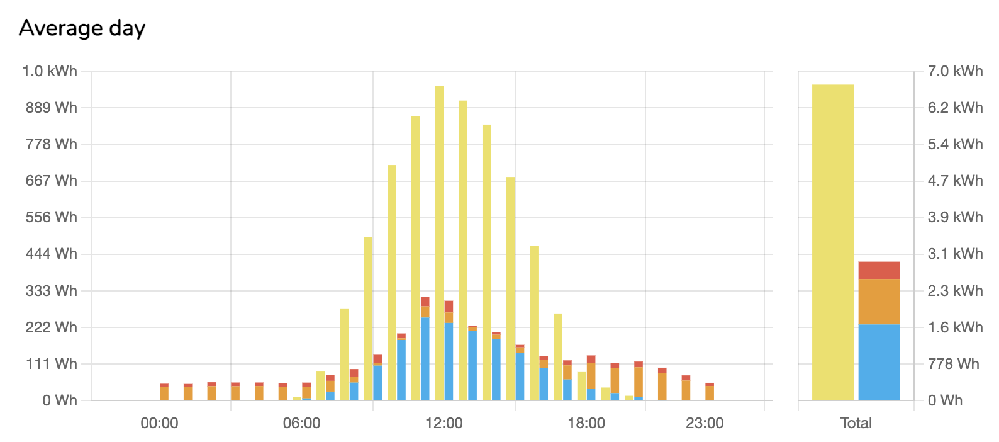

# Purpose

I wanted to be able to answer questions like `how much energy do I use and produce on an average day`, `how often do I produce more energy than I use`, `On which day did I produce the most energy`, ... So I've created this scraper to analyze the data and answer these questions.


# Setup

Install dependencies

```
yarn
```

Next you need to generate some data. See the [Scraping](#scraping) section below.

Running the app locally

```
yarn dev
```

The frontend is built using Vue 3 and Vite.

# Scraping

For now this can only scrape the fusion solar portal (Huawei) but as long as at least hourly data for some basic metrics (power generated, powered used, ...) is available, it should be possible to add a scraper for it. Feel free to create a PR when if you do.

Run `yarn scrape --help` to see which options are available

## Fusion solar

The minimum configuration is the bspsession and station DN, you can find both of these in your browser dev tools after signing in.

```
yarn scrape -b <bspsession> -s <stationdn>
```
